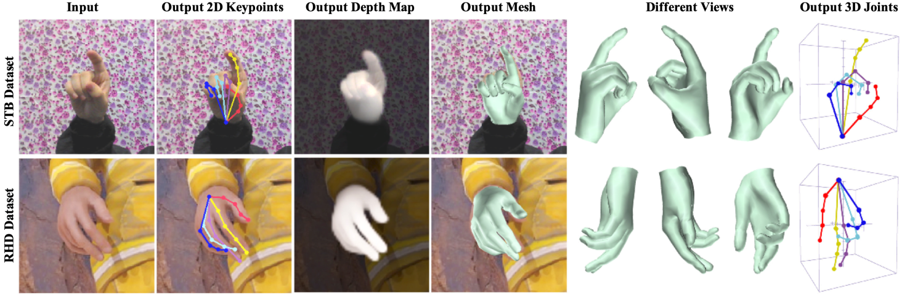
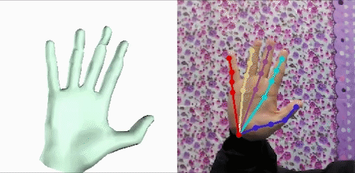

# BiHand - 3D Hand Mesh Reconstruction

This repo contains demo, testing code and models for paper: "BiHand: Recovering Hand Mesh with Multi-stage Bisected Hourglass Networks"  
Lixin Yang, Jiasen Li, Wenqiang Xu, Yiqun Diao, Cewu Lu 




## Get the code
```
git clone --recursive https://github.com/lixiny/bihand.git
cd bihand
```
## Install Requirements 
Install the dependencies listed in `environment.yml` through conda:
- We recommend to firstly install Pytorch with cuda enabled.
- Create a new conda environment:   
`conda env create -f environment.yml `
- Or in an existing conda environment:  
`conda env update -f environment.yml` 

The above operation works well if you are lucky.   
However, we found that 
installing opendr is tricky. We solved the errors by:  
```
sudo apt-get install libglu1-mesa-dev freeglut3-dev mesa-common-dev
sudo apt-get install libosmesa6-dev 
## then reinstall opendr again
pip install opendr
```

## Download and Prepare Datasets  

- Create a data_root directory at `/path/to/data_root`
- Download RHD dataset on the [dataset page](https://lmb.informatik.uni-freiburg.de/resources/datasets/RenderedHandposeDataset.en.html) and extract it in `data_root/RHD`.   

- Download STB dataset on the [dataset page](https://sites.google.com/site/zhjw1988/) and extract it in `data_root/STB`
- Download STB_supp dataset on [Google Drive](https://drive.google.com/file/d/1uAP2-U_sQkl1Ez4JkaDl01DA-Qiq2PI-/view?usp=sharing) | [Baidu Pan](https://pan.baidu.com/s/1ja23wnTsPPsjLrkE6d8s-w)(`v858`) and merge it into `data_root/STB`.  
 (In STB, We generated *aligned* and *segmented* hand depthmap from the original depth image)  

Now your `data_root` folder structure should like this:
```
data_root/
    RHD/
        RHD_published_v2/
            evaluation/
            training/
            view_sample.py
            ...

    STB/
        images/
            B1Counting/
                SK_color_0.png
                SK_depth_0.png
                SK_depth_seg_0.png  <-- merged from STB_supp
                ...
            ...
        labels/
            B1Counting_BB.mat
            ...
```

## Download and Prepare model files 

### MANO model
- Go to [MANO website](http://mano.is.tue.mpg.de/)
- Create an account by clicking *Sign Up* and provide your information
- Download Models and Code (the downloaded file should have the format `mano_v*_*.zip`). Note that all code and data from this download falls under the [MANO license](http://mano.is.tue.mpg.de/license).
- unzip and copy the `models` folder into the `manopth/mano` folder  

Now Your `manopth` folder structure should look like this:
```
manopth/
  mano/
    models/
      MANO_LEFT.pkl
      MANO_RIGHT.pkl
      ...
  manopth/
    __init__.py
    ...
```
### BiHand models 
- Download BiHand weights `checkpoints.tar.gz` from [Google Drive](https://drive.google.com/file/d/1evdNbFBRfDzVykNJFrEnPyicX9-jTa7J/view?usp=sharing) | [Baidu Pan](https://pan.baidu.com/s/1gyYcCTXjiGRtJ6WeLNtcXQ)(`w7pq`)
- unzip and copy the `checkpoints` folder into current directory

Now your `BiHand-test` folder should look like this:  
```
BiHand-test/
    bihand/
    checkpoints/
        ├── ckp_seednet_all.pth.tar
        ├── ckp_siknet_synth.pth.tar
        ├── rhd/
        │   ├── ckp_liftnet_rhd.pth.tar
        │   └── ckp_siknet_rhd.pth.tar
        └── stb/
            ├── ckp_liftnet_stb.pth.tar
            └── ckp_siknet_stb.pth.tar
    ...
```

## Launch Demo

- First, add this into current bash or ~/.bashrc  
`export PYTHONPATH=/path/to/bihand:$PYTHONPATH` 

- to test on RHD dataset:   
```
python testing/test_bihand.py \
    --batch_size 8 --checkpoint checkpoints --data_root /path/to/data_root --fine_tune rhd
```
- to test on STB dataset: 
```
python testing/test_bihand.py \
    --batch_size 8 --checkpoint checkpoints --data_root /path/to/data_root --fine_tune stb
```
- add `--vis` to visualize: 

  


## Limitation 

Currently the BiHand-test requires camera intrinsics, root depth and bone length as inputs, thus cannot be applied in the wild. 

More functionality will be released with the train code.


## Acknowledgement  

- Code of Mano Pytorch Layer in `manopth` was reused from [manopth](https://github.com/hassony2/manopth), appreciate Yana Hasson.


- Code for evaluating the hand PCK and AUC in `bihand/eval/zimeval.py` was reused from [hand3d](https://github.com/lmb-freiburg/hand3d), appreciate Christian Zimmermann.

- Code of data augmentation in `bihand/datasets/handataset.py` was adapted from [obman](https://hassony2.github.io/obman), appreciate Yana Hasson agian. 

- Code of STB datasets `bihand/datasets/stb.py` was adapted from [hand-graph-cnn](https://github.com/3d-hand-shape/hand-graph-cnn), appreciate Liuhao Ge.  

- Code of our Bisected Hourglass Network `bihand/models/hourglass.py` was modified from [pytorch-pose](https://github.com/bearpaw/pytorch-pose), appreciate Wei Yang for original implementation.  


